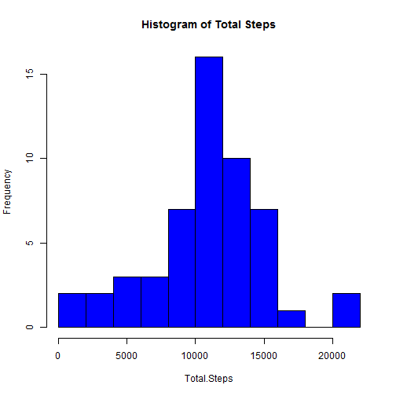
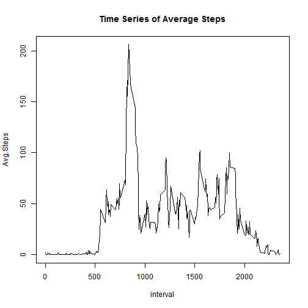
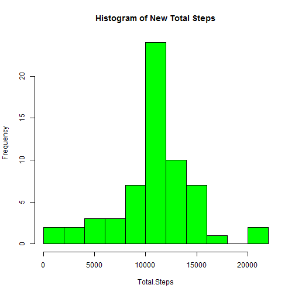
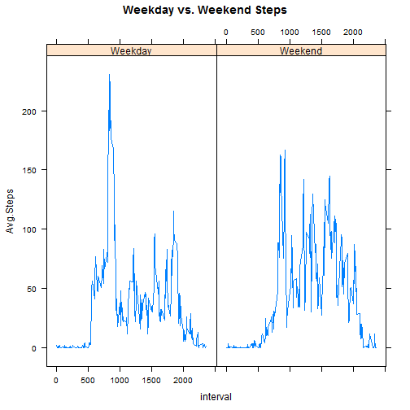

## Load needed libraries


```r
library(dplyr)
library(lattice)
library(knitr)
library(lubridate)
```

## Loading and preprocessing the data


```r
activity<-read.csv("activity.csv", header=TRUE, stringsAsFactors=FALSE)
activity$date2<-as.factor(activity$date)
activity$date<-strptime(activity$date,format="%Y-%m-%d")
```


## What is mean total number of steps taken per day?

Calculate total number of steps

```r
step_total<-activity%>%select(-date)%>%group_by(date2)%>%summarise(Total.Steps=sum(steps))
step_total
```

```
## Source: local data frame [61 x 2]
## 
##         date2 Total.Steps
## 1  2012-10-01          NA
## 2  2012-10-02         126
## 3  2012-10-03       11352
## 4  2012-10-04       12116
## 5  2012-10-05       13294
## 6  2012-10-06       15420
## 7  2012-10-07       11015
## 8  2012-10-08          NA
## 9  2012-10-09       12811
## 10 2012-10-10        9900
## ..        ...         ...
```

Create histogram

```r
with(step_total,hist(Total.Steps, col="blue", breaks=10, main="Histogram of Total Steps"))
```

 

Calculate Mean and Median

```r
mean1<-with(step_total,mean(Total.Steps,na.rm=TRUE))
median1<-with(step_total,median(Total.Steps,na.rm=TRUE))
```

We see that the mean is 1.0766189 &times; 10<sup>4</sup> and the median is 10765.


## What is the average daily activity pattern?

Calculate Mean for each 5 minute interval

```r
step_avg<-activity%>%select(-date)%>%group_by(interval)%>%
          summarise(Avg.Steps=mean(steps,na.rm=TRUE))
```
Plot time series of intervals and average steps

```r
with(step_avg,plot(interval,Avg.Steps,type="l", main="Time Series of Average Steps"))
```

 

Find time interval with largest number of average steps

```r
max(step_avg$Avg.Steps)
```

```
## [1] 206.1698
```

```r
max.int<-filter(step_avg,Avg.Steps>=200)$interval
```
We see that the highest number of steps occurs at 835 interval.

## Imputing missing values

Calculate number of NAs

```r
nas<-sum(is.na(activity$steps))
```
The total number of NAs is 2304.

Strategy: Replace NAs by mean of interval

```r
activity2<-select(activity,-date)
activity2<-left_join(activity2,step_avg,by="interval")

activity.not.na<-activity2%>%filter(!is.na(steps))%>%mutate(newsteps=steps)
activity.na<-activity2%>%filter(is.na(steps))%>%mutate(newsteps=Avg.Steps)

activity.new<-bind_rows(activity.not.na,activity.na)%>%select(-steps,-Avg.Steps)%>%
              arrange(date2,interval)
```

Calculate new total steps

```r
step_total.new<-activity.new%>%group_by(date2)%>%summarise(Total.Steps=sum(newsteps))
step_total.new
```

```
## Source: local data frame [61 x 2]
## 
##         date2 Total.Steps
## 1  2012-10-01    10766.19
## 2  2012-10-02      126.00
## 3  2012-10-03    11352.00
## 4  2012-10-04    12116.00
## 5  2012-10-05    13294.00
## 6  2012-10-06    15420.00
## 7  2012-10-07    11015.00
## 8  2012-10-08    10766.19
## 9  2012-10-09    12811.00
## 10 2012-10-10     9900.00
## ..        ...         ...
```

Create histogram for new total steps

```r
with(step_total.new,hist(Total.Steps, col="green", breaks=10, main="Histogram of New Total Steps"))
```

 

Calculate Mean and Median for new total steps

```r
mean2<-with(step_total.new,mean(Total.Steps,na.rm=TRUE))
median2<-with(step_total.new,median(Total.Steps,na.rm=TRUE))
```

The new mean is 1.0766189 &times; 10<sup>4</sup> and the new median is 1.0766189 &times; 10<sup>4</sup>.
Yes, these values are different. 
The mean is unchanged but the median now equals the mean.
Overall the impact is very small since the mean and median were close to start with.

## Are there differences in activity patterns between weekdays and weekends?

Create weekday/weekend separation by filtering by weekday, labeling, and then rejoining.

```r
activity.new<-activity.new%>%mutate(weekday=weekdays(ymd(date2)))
activity.new.wkd<-activity.new%>%filter(weekday!="Saturday",weekday!="Sunday")%>%mutate(day.type="Weekday")
activity.new.wke<-activity.new%>%filter(weekday=="Saturday"|weekday=="Sunday")%>%mutate(day.type="Weekend")
activity.new<-bind_rows(activity.new.wkd,activity.new.wke)%>%arrange(date2,interval)
activity.new$weekday<-as.factor(activity.new$weekday)
activity.new$day.type<-as.factor(activity.new$day.type)
```

Calculate Mean for each 5 minute interval separated by Weekday and Weekend

```r
step_avg.new<-activity.new%>%group_by(interval,day.type)%>%
  summarise(Avg.Steps=mean(newsteps))
```

Create panel plot to compare Weekday and Weekend number of steps

```r
xyplot(Avg.Steps~interval|day.type,data=step_avg.new,type="l", main="Weekday vs. Weekend Steps")
```

 
